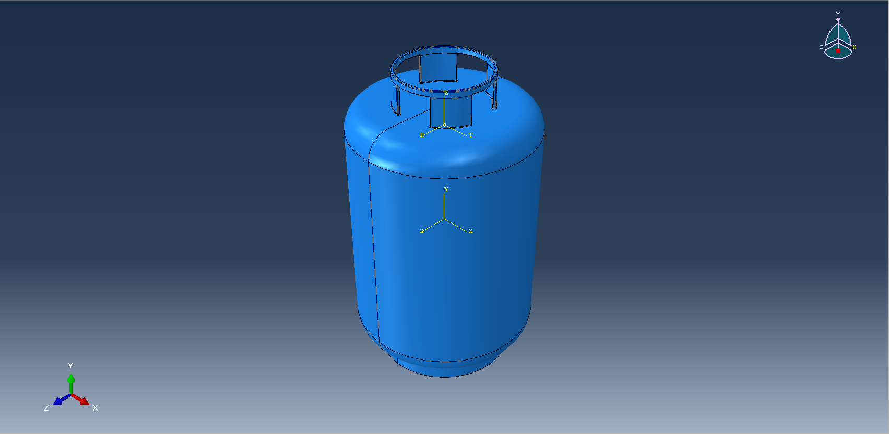
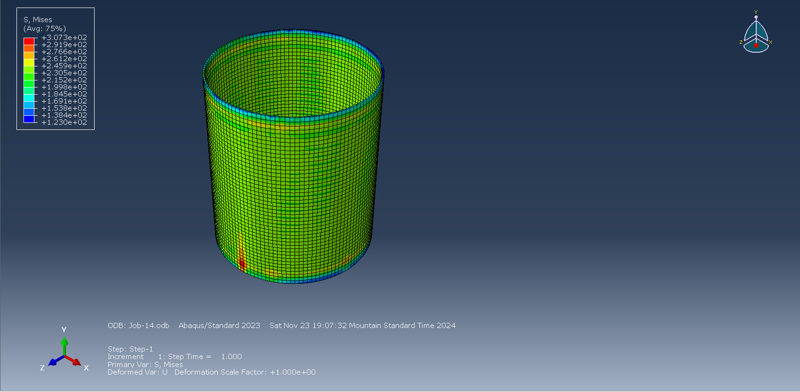
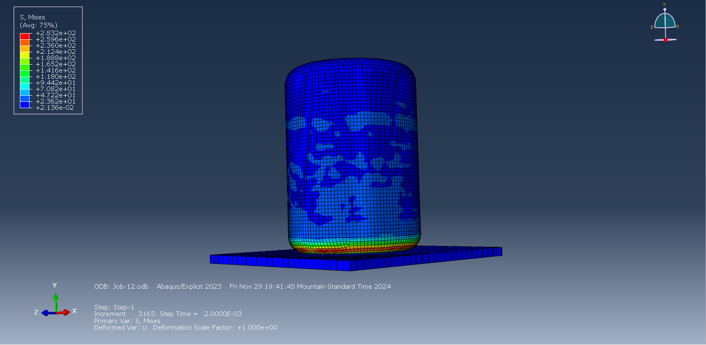

# Gas Cylinder Static and Impact Test Simulation in Abaqus

This project simulates the structural behavior of a high-pressure gas cylinder under internal pressure and dynamic impact loading using **Abaqus**. The analysis includes: (1) **static pressure loading** (2) **explicit dynamic impact testing** 

  

  

  

